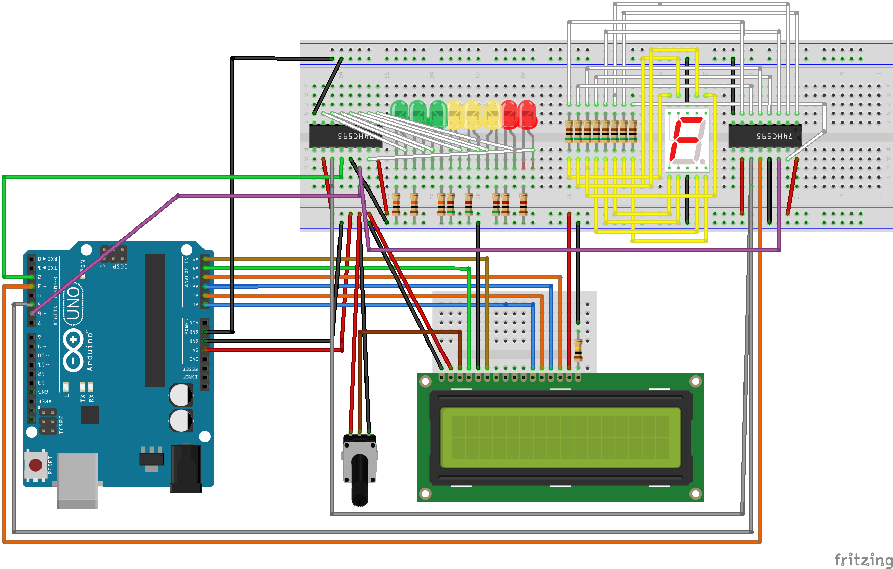

= `Device/UnoR3`

The Arduino Uno R3 is a fairly versatile and cheap device
that supports several elements of the dashboard.

In this folder you will find all you need to build and run Simdisplay on this device.

== File and Folder Reference

|===
|README.adoc |This very document.
|ArduinoIDE |The Arduino IDE project is in there.
|SimDisplay_UnoR3.fzz |The breadboard wiring diagram; you will need Fritzing 0.9 to edit this. 
|SimDisplay_UnoR3_BOM.html |The Bill Of Materials (BOM) exported from Fritzing.
|SimDisplay_UnoR3_breadboard.png |The breadboard wiring diagram, exported as a picture.
|===

== Shop for and Build your device

The https://htmlpreview.github.io/?https://github.com/fenegroni/simdisplay/blob/master/Device/UnoR3/SimDisplay_UnoR3_BOM.html[Bill Of Materials (BOM)] found in this folder
lists all the items you need to build the Simdisplay Uno R3 dashboard.

Once you have all the necessary parts, you can start assembling the parts on a breadboard
according to the link:SimDisplay_UnoR3.fzz[Fritzing breadboard wiring diagram]:

== Build and Upload the Firmware
